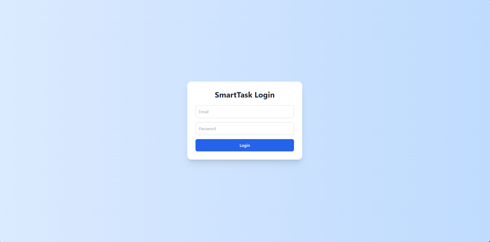
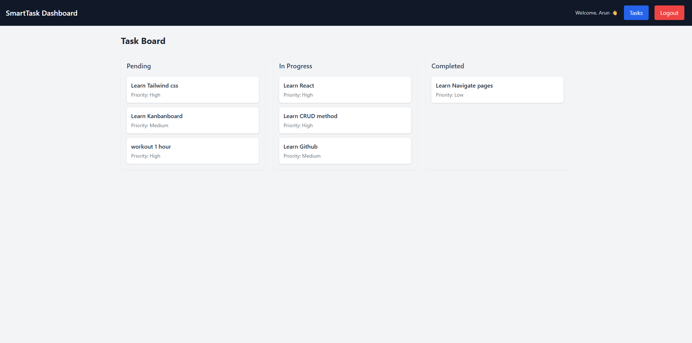
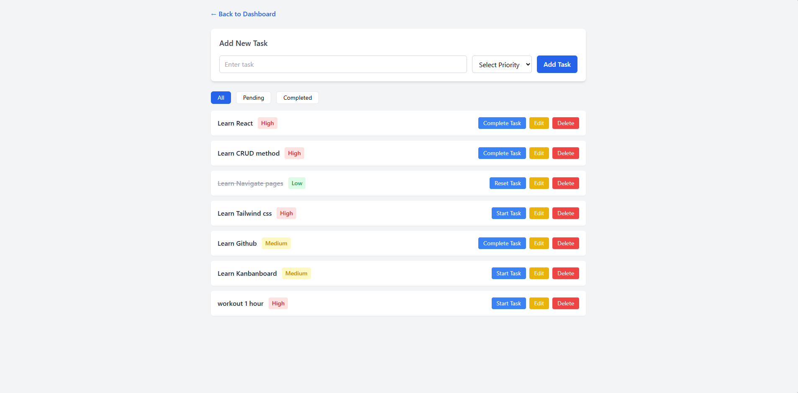

# SmartTask Pro

SmartTask Pro is a modern **React-based task management application** that allows users to create, manage, and track tasks using a Kanban-style board.

The application demonstrates core frontend development concepts including authentication, CRUD operations, API communication, protected routes, and responsive UI using Tailwind CSS.

---

## Features

- User Login Authentication
- Protected Routes
- Task Management (Create, Edit, Delete)
- Task Status Management
- Kanban Board (Pending / In Progress / Completed)
- Task Filtering
- Responsive UI using Tailwind CSS
- API communication using Axios
- Fake REST API using JSON Server

---

## Features

- User Login
- Protected Routes
- Create Tasks
- Update Tasks
- Delete Tasks
- Fake backend using json-server
- API requests using axios

## Tech Stack

Frontend:

- React
- React Router
- Tailwind CSS
- Axios

Backend (Mock API):

- JSON Server
- Vite

Tools:

- Vite
- Git
- GitHub

---

<markdown>

## Project Screens

### Login Page



User authentication before accessing the dashboard.

### Dashboard



Kanban-style board showing task status.

### Task Page



Manage tasks with CRUD operations and filtering.

## </markdown>

## Installation

Clone the repository

git clone https://github.com/Arun-prasad27/smarttask-pro.git

Go to Project folder: cd smarttask-pro
Install dependencies: npm install
start frontend server: npm run dev
start fake API server: npx json-server --watch db.json --port 3001
Open in browser: http://localhost:5173

Test Credentials
Admin user: admin@gmail.com
Password: 123456

<markdown>

Project Structure

```
src
├── components
│ ├── KanbanBoard.jsx
│ ├── KanbanColumn.jsx
│ ├── Navbar.jsx
│ ├── ProtectedRoute.jsx
│ ├── TaskForm.jsx
│ └── TaskList.jsx
│
├── pages
│ ├── Login.jsx
│ ├── Dashboard.jsx
│ ├── Taskpage.jsx
│ └── Notfound.jsx
│
├── services
│ └── api.js
│
├── App.jsx
├── main.jsx
└── index.css
```

</markdown>
API Endpoints
GET /tasks
POST /tasks
PUT /tasks/:id
DELETE /tasks/:id

Author
Arun Prasad

GitHub
https://github.com/Arun-prasad27

Portfolio
https://arun-prasad27.github.io/My-Portfolio/
